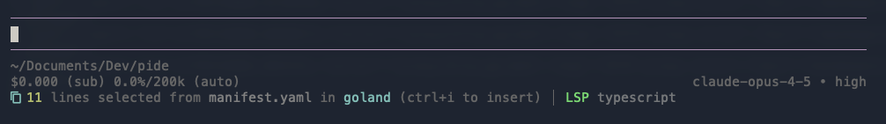

# pide - IDE Integration for Pi

Shows your current IDE file/selection in [pi](https://github.com/badlogic/pi-mono) and lets you quickly reference it with `Ctrl+I`.



## Installation

### Pi Extension

```bash
# Install from git
pi install github.com/penberg/pide

# Or try without installing
pi -e git:github.com/penberg/pide
```

### IDE Plugins

**VS Code / Cursor / VSCodium:**
```bash
code --install-extension ./vscode-plugin/pide-vscode-0.1.0.vsix
```

**JetBrains (IntelliJ, GoLand, WebStorm, PyCharm, etc.):**
1. Build: `cd jetbrains-plugin && ./gradlew buildPlugin`
2. Install: Settings → Plugins → ⚙️ → Install from Disk → select `build/distributions/pide-jetbrains-0.1.0.zip`

## Usage

1. Open pi in a terminal
2. Select code in your IDE → status appears in pi's footer
3. Press `Ctrl+I` to insert file reference into your prompt

**Commands:**
| Command | Description |
|---------|-------------|
| `/ide` | Insert file reference into editor |
| `/ide-clear` | Clear the current selection |

## How It Works

```
┌─────────────┐                           ┌─────────────┐
│    IDE      │ ───── writes to ─────────▶│ ~/.pi/      │
│             │                           │ ide-selection.json
└─────────────┘                           └──────┬──────┘
                                                 │
                           ┌─────────────────────┼─────────────────────┐
                           │ file watch          │ file watch          │
                           ▼                     ▼                     ▼
                    ┌─────────────┐       ┌─────────────┐       ┌─────────────┐
                    │  pi (term1) │       │  pi (term2) │       │  pi (term3) │
                    └─────────────┘       └─────────────┘       └─────────────┘
```

All pi instances see the selection via file-based communication. No port conflicts!

## JSON Format

IDEs write to `~/.pi/ide-selection.json`:

```json
{
  "file": "/absolute/path/to/file.ts",
  "selection": "selected text (optional)",
  "startLine": 10,
  "endLine": 15,
  "ide": "vscode",
  "timestamp": 1707570000000
}
```

## Building IDE Plugins

### VS Code

```bash
cd vscode-plugin
npm install
npm run compile
npm run package
```

### JetBrains

```bash
cd jetbrains-plugin
./gradlew buildPlugin
```

## License

MIT
